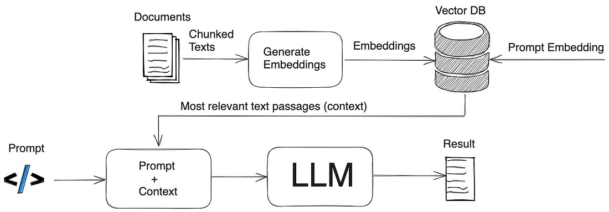

Krishi Mitra: An AI-Driven Retrieval-Augmented Generation System for
Scheme Accessibility in India

> Ajith K Narayana^1^ Anagha K A Bhat^2^ Madhan Kumar S^3^ Rakshitha ^4^
> Geethapriya G H^5^ Rashmi K S^6^

^1,\ 2,\ 3,\ 4,\ 5^ *Department of Computer Science and Engineering*

^6^ *Department of Information Science and Engineering*

*Jyothy Institute of Technology, Bangalore, Karnataka, India*

**Abstract**

Agricultural well-being and rural development are two central components
of India\'s policy strategy. Nevertheless, efficient delivery and
implementation of government initiatives and new practices by rural
farming communities are a tall order with linguistic diversity, digital
illiteracy, and information imbalance. In this paper, we investigate the
use of Retrieval-Augmented Generation (RAG) models in developing a
multilingual conversational farmer assistant, known as Krishi Mitra. The
model combines Large Language Models (LLMs), voice interfaces, knowledge
lookup, and context-sensitive generation to bridge the gap in access to
government schemes and agriculture knowledge. We scrape agriculture
welfare data, train vector embeddings, and build a real-time assistant
generating accurate, region-aware answers in local Indian languages in
real-time. Our findings show that RAG-enabled assistants improve
response factuality by a large margin, reduce hallucination, and boost
user satisfaction. The research demands India-specific linguistic and
infrastructural context-based rural support systems that are based on
AI.

> **Keywords:** Krishi Mitra, Conversational AI, Retrieval-Augmented
> Generation, Agricultural Schemes, Rural Development, LLMs, Voice
> Assistant

**1. Introduction**

> India boasts the world\'s largest rural population with more than 70%
> of its population residing in villages and relying mainly on
> agriculture as a source of income. With socio-economic importance,
> agriculture is still beset by age-old problems, especially that of
> information sharing and availability of information critical to the
> health and productivity of the rural farmers. Schemes like PM-KISAN,
> which offer direct income support, PMFBY, which offers crop insurance,
> and e-NAM, which facilitates online agricultural trade, have been
> launched by the government to transform and benefit the rural
> agriculture space. Yet, noted uptake and use of such initiatives is
> woefully low because of a range of determinants such as lack of
> awareness, educational disadvantage, digital illiteracy, lack of good
> internet infrastructure, linguistic diversity, and lack of local
> accessible information delivery systems. This has been further widened
> by the digital divide between rural and urban India, wherein urban
> citizens have access to a broad range of AI-based and digital public
> services whereas rural farmers are unaware or cannot avail of such
> technology. The refusal of official websites to be browsed, the
> prevalence of English and Hindi on the web, and the lack of proper
> assimilation of local languages render it a case of exclusion of vast
> portions of rural citizens. While conversational AI models based on
> large language models (LLMs) empower GPT-4, BERT, and other models to
> transform information searching and human-machine interaction in
> cities, the models\' performance deteriorates significantly when
> implemented in multilingual, low-literacy rural environments. The
> models are susceptible to the generation of false data, known as
> hallucinations, are not capable of naturally supporting Indian
> regional languages, are unable to preserve context while engaged in
> multi-turn dialogues, and are unable to ground themselves upon
> real-world data. To counteract these issues, this research introduces
> Krishi Mitra -- a dialogue-based AI assistant specifically designed
> for Indian farmers. Krishi Mitra relies on the Retrieval-Augmented
> Generation (RAG) architecture that facilitates improved quality and
> accuracy of AI answers by drawing upon retrieval components that pull
> data from tested government databases, agricultural websites, and
> research libraries prior to generating an answer. In contrast to
> conventional chatbots, Krishi Mitra is based on precise, real-time
> facts and enables both text and voice-based interaction in several
> regional languages including Kannada, Tamil, Telugu, Marathi, and
> Bengali. It is thus highly accessible to farmers of any literacy level
> or technical know-how. The assistant is not only capable of producing
> output in text form but also in synthesized speech voice as well as
> even visual forms such as graphs or pictures if needed, providing a
> multimodal interface responsive to varying needs of the users. The
> software is designed to operate in low-connectivity conditions as well
> as on low-power devices, so even rural villagers from far-flung areas
> are able to make use of its functionality. Apart from this, Krishi
> Mitra would be upgraded in the future with fresh government schemes,
> farm advisories, market statistics, and state news as and when they
> are available. In the paper, the design aspects, implementation
> tactics, and performance evaluation of Krishi Mitra are discussed,
> with various combinations of LLMs, embedding models, and vector
> databases compared to identify the best architecture for rural
> deployment. In addition, the social benefits of implementing such a
> system are also taken into account, such as facilitating more
> participation in the scheme, enhancing farm decision-making, less
> reliance on intermediaries, and digital inclusion. Merging speech
> recognition and synthesis into local dialects is a paradigm change in
> the interface, which becomes conversational, simple, and even viable
> for the digitally illiterate. Krishi Mitra is not just imagined as a
> chatbot, but as a digital agrarian companion---a one that informs and
> enables farmers, makes support more accessible, and closes the
> existing gap between technology and rural existence. Given that
> agriculture is exposed to new environmental, economic, and social
> threats, innovations such as Krishi Mitra are well positioned to show
> the transformational potential of inclusive AI systems designed for
> equity, sustainability, and empowerment of rural India.

**2. Literature Review**

> Use of Retrieval-Augmented Generation (RAG) in natural language
> processing has come a long way with its capacity to enhance factual
> accuracy and evidential support of generative models. RAG models, in
> contrast to conventional LLMs that only depend on pre-trained data,
> offer retrieval using a reliable corpus and generative modeling,
> leading to richer contextual and credible outputs. Ji et al. (2022)
> \[28\] prepared a comprehensive review of hallucination in natural
> language generation and found that RAG is one of the top architectures
> to address such problems, especially in safety-critical applications.
> Huayang et al. (2022) \[25\] also reviewed the landscape of RAG models
> and described their use in enriching information retrieval towards
> domain-related scenarios.
>
> These studies determine why factual coherence in the generated
> responses is significantly enhanced as models are based on external
> document sources. Cortés-Cediel et al. (2023) \[17\] further discussed
> the application of RAG in public administration use, citing that
> RAG-based systems improved participatory citizenship and trust since
> policy vocabulary is better clarified. Such advantages are highly
> useful in rural and agriculture technology. The capability to render
> sophisticated government schemes in vernacular and context-sensitive
> formats gives RAG high prospects for digital inclusiveness in rural
> governments. In addition, the continuous updating of features in
> software such as Memo-RAG and Iter-RetGen provides multi-hop reasoning
> enhancements that allow for more sophisticated queries to be responded
> to via long-context document streams---something very relevant for
> schemes that have hierarchical eligibility or state-dependent
> restrictions. This paper develops such RAG breakthroughs and
> recontextualizes them within an Indian rural setting, prioritizing
> language diversity and access issues.
>
> The emergence of Retrieval-Augmented Generation (RAG) as a leading
> benchmark for the development of natural language systems with
> emphasis placed on factual coherence and domain transfer has been the
> case. Given that RAG involves the merger of two primary
> elements---retrieval-based information systems and generative language
> models---RAG does better than normal large language models (LLMs) in
> that it bases their responses on pulled information sourced from
> trusted sources. The two-stage method solves one of the most prevalent
> issues in LLMs: hallucination, where the model produces factually
> inaccurate or contextually unrelated output. RAG avoids this by
> utilizing a retriever module that first chooses top-k relevant
> documents from an external corpus and then a generator module (often a
> transformer-based LLM) which conditions its output based on this
> evidence. The greatest strength of RAG is its capacity for domain
> generalization with little fine-tuning, and thus be especially useful
> in low-resource or changing environments. Huayang Li et al. (2022)
> \[25\] contain a complete description of the RAG model and its
> variants, highlighting its capacity to facilitate dynamic content
> generation that can remain semantically and factually consistent with
> external documents.

**3. Methodology**

This section addresses the data ingestion pipeline, data pre-processing,
and embedding method used to provide the RAG-based system. Data were
extracted from over 3,000 schemes of agriculture from public websites
such as MyScheme.gov.in and state-agriculture portals. Every scheme
record contained metadata like eligibility, benefit, required documents,
application process, and FAQs. The unstructured data were cleaned,
normalized, and placed in structured JSON format. For semantic search,
the textual material was mapped to vector embeddings with two models:
Google\'s models/embedding-001 and nomic-embed-text. The embeddings were
kept in ChromaDB to enable fast semantic lookup. The data ingestion
pipeline was constructed with Python 3.10.12, Selenium for dynamic
content scraping, and LangChain document loader utilities for ingesting
scheme content. A FastAPI backend was employed to construct an API for
serving responses and queries. This configuration allowed the
application to provide region-specific information with high accuracy
and low latency. This study employs an extensive methodology with the
purpose of building a Retrieval-Augmented Generation (RAG) driven
multilingual chatbot model that will give rural citizens precise and
meaningful information while they seek government schemes. The
methodology starts with web scraping structured as well as unstructured
information from web pages like MyScheme.gov.in and other state
government agricultural portal sites. Over 3,000 schemes were
programmatically crawled using Python scripts and Selenium dynamic web
scraping. Information on each scheme, such as title, benefits,
eligibility, documents, and application process, were cleaned, filtered,
and transformed into a uniform JSON format for preserving consistency
and ease in downstream processing.

The cleaned data were further translated into semantic vector embeddings
using two models of embeddings: Google\'s models/embedding-001 and
Nomic\'s nomic-embed-text. These embeddings are the text\'s semantic
content and have been preserved in ChromaDB, a high-performance,
scalable vector database optimized for semantic retrieval. With this,
the system can provide responses with the relevant pieces of information
by matching the user\'s query against the nearest textual fragments.
After creating the pipeline for data ingestion and storage, the query
processing layer was implemented using FastAPI for backend interactions
and React for frontend rendering. The user communicates with the system
using voice or text commands, which are processed by Google\'s
Speech-to-Text API and Translation API to translate the command into
English. The translated query is then converted to a vector and compared
against the ChromaDB index to obtain some scheme information. This
learned knowledge is then transferred to a Large Language Model
(LLM)---such as Gemini Pro or LLaMA3---so that not just is the response
contextually accurate but it also comes from real knowledge. The final
output is then converted back into the user\'s language of preference
and communicated through text and speech by Google\'s Text-to-Speech
API. This multimodal, multilingual pipe guarantees access to scheme data
for linguistic and educational users under all circumstances including
low-resource, offline-first environments. With the synergy of real-time
retrieval capability and LLMs\' generation capacity, the system
minimizes hallucinations, maximizes semantic accuracy, and produces
responses in a readable format optimal for India\'s rural masses.

**4. Experimental Result:**

All the model evaluation experiments were performed using two LLMs,
Gemini 1.5 Pro and LLaMA3, and two embedding models. Model performance
was evaluated with and without RAG integration, comparing metrics such
as similarity score, uncertainty, and hallucination rate. The evaluation
results with different setups are presented in Tables 5--7. LLMs were
inconsistent and fact-grounding-deficient without RAG, but with the
integration of RAG, the system produced much more trusted output.
Interestingly, the Gemini + models/embedding-001 configuration logged
highest similarity scores and lowest hallucination rates. The semantic
search mechanism was best able to limit most appropriate scheme records,
enhancing model accuracy for a broad spectrum of user prompts in several
languages. The results confirm the efficacy of mashing up retrieval with
generative operations for rural, multilingual use cases.

**Table 1** Sample scraped data fields

+---------------------+------------------------------------------------+
| > **Field**         | > **Example**                                  |
+=====================+================================================+
| Scheme Name         | PM-KISAN                                       |
+---------------------+------------------------------------------------+
| Eligibility         | Small/Marginal Farmers                         |
+---------------------+------------------------------------------------+
| Documents           | > Adhar,Land records                           |
+---------------------+------------------------------------------------+
| Benefits            | > ₹6000/year DBT                               |
+---------------------+------------------------------------------------+
| Application Mode    | > Online/offline                               |
+---------------------+------------------------------------------------+

The data was converted to embeddings using **Gemini-embedding-001** and
**Nomic-embed-text** models and stored in **ChromaDB**.

> **Table 2** Tools and Libraries for Ingestion Pipeline

+---------------+-----+-----------------------------------------------+
| > **Tools**   | **  | > **Purpose**                                 |
|               | Ver |                                               |
|               | sio |                                               |
|               | n** |                                               |
+===============+=====+===============================================+
| > Python      | 3   | > The programming language used for scripting |
|               | .10 | > and automation in the ingestion pipeline    |
|               | .12 |                                               |
+---------------+-----+-----------------------------------------------+
| > Selenium    | >   | > Web automation tools used to interact with  |
|               | 4.2 | > agricultural and scheme-related websites.   |
|               | 4.0 | > These tools help navigate web pages,        |
|               |     | > extract structured scheme data, and handle  |
|               |     | > dynamic content.                            |
+---------------+-----+-----------------------------------------------+
| > Langchain's | >   | > **Data Loading**: Loads scheme-related      |
|               | 4.2 | > content from JSON files and organizes it    |
|               | 4.0 | > for embedding generation.                   |
+---------------+-----+-----------------------------------------------+
| > Chroma DB   | >   | > **Embedding Storage:** Stores the generated |
|               | 0.2 | > vector embeddings for fast and efficient    |
|               | .16 | > semantic search during query resolution.    |
+---------------+-----+-----------------------------------------------+
| > Gemini      | >   | > **Embedding Generation:** Converts textual  |
|               | 001 | > data into numerical vectors that capture    |
| mod           |     | > semantic meaning. Offers high-quality text  |
| els/embedding |     | > embeddings, capturing semantic nuances      |
| (35)          |     | > effectively.                                |
+---------------+-----+-----------------------------------------------+

Initialization and Setup: The scraper is intended to scrape government
agricultural welfare websites, i.e., MyScheme.gov.in and state
agriculture department websites. It uses Selenium WebDriver with
Chrome/Firefox to handle dynamic web elements and scrape data displayed
through JavaScript. Collecting Scheme Links and Basic Information: The
scraper browses through the portal landing page, waits until content
loads completely, and collects basic scheme details like scheme name,
category, location, and detail page links. All this information is
formatted and stored in a list of dictionaries for later processing.

Fetching Detailed Information: In each of the schemes listed above, the
scraper visits the detail page and fetches structured information like
scheme description, eligibility, benefits, required documents,
application procedure, and FAQs. Exception handling procedures are
present in it so that data extraction goes uninterrupted even when there
are missing fields or pages are being displayed in an irregular way.
Data Gathering: The data scraped is populated into the related scheme
entries within the dictionary list. After completing the scraping
process, the browser session is destroyed and the full dataset is
gathered into one collective JSON structure.

RAG Chain: The Krishi Mitra platform uses a Retrieval-Augmented
Generation (RAG) chain on the scraped information. When a user
voice/text input is received, the appropriate vector-embedded chunks of
scheme data are retrieved and fed as input to an LLM in order to produce
a correct reply. The last structured data is saved in JSON file format.
The file has a comprehensive list of government agriculture schemes
along with metadata, prepared to be indexed, semantic searched, and
utilized by the Krishi Mitra assistant. Once the agricultural scheme
information is scraped and stored in JSON, the text is vectorized into
embeddings to facilitate semantic search effectively. The embeddings
capture the semantics of scheme-related text so that the system is able
to search and retrieve important information for user queries. Krishi
Mitra employs Gemini models/embedding-001 and Nomic-embed-text to
produce high-quality embeddings. These are saved in ChromaDB, allowing
for quick and precise similarity searches in the RAG framework.

**Conversational Chatbot Pipeline**

> {width="4.50333552055993in"
> height="2.4583333333333335in"}
>
> **Figure 3** Retrieval Augmented Generation Pipeline
>
> **Table 3** Tools and Libraries for Chatbot Pipeline

+-----------------------+---------+------------------------------------+
| > **Tools**           | > **Ve  | > **Purpose**                      |
|                       | rsion** |                                    |
+=======================+=========+====================================+
| Front end (React)     | React   | > Users interact via a React-based |
|                       | v18.3.1 | > interface.                       |
+-----------------------+---------+------------------------------------+
| > FastAPI Backend     | >       | Manages API interactions and       |
|                       | 0.114.0 | processes user inputs.             |
+-----------------------+---------+------------------------------------+
| > Google Speech to    | > V1    | > Handles conversion of speech to  |
| > Text API            |         | > text                             |
+-----------------------+---------+------------------------------------+
| Google Text-Speech    | V1      | > Handles conversion of text to    |
| API                   |         | > speech                           |
+-----------------------+---------+------------------------------------+
| Google Translation    | V3      | > Handles multi-language           |
| API                   |         | > processing.                      |
+-----------------------+---------+------------------------------------+
| Llama3 LLM Model      | V3      | > A language model generating      |
|                       |         | > responses.                       |
+-----------------------+---------+------------------------------------+
| Gemini Pro LLM Model  | 1.5 Pro | > A language model generating      |
|                       | (       | > responses.                       |
|                       | Google, |                                    |
|                       | 2024)   |                                    |
+-----------------------+---------+------------------------------------+

> In essence, the Krishi Mitra system effectively integrates data
> retrieval and response generation to provide precise and
> context-sensitive chatbot experiences to rural users. Farmers can
> query using voice or text via a straightforward React-based user
> interface. The input is translated into English using Google\'s
> speech-to-text and translation APIs. The translated input is then
> passed through a semantic search engine to fetch the most suitable
> agricultural scheme details for response generation.
>
> Semantic search and retrieval in Krishi Mitra translate queries from
> farmers into vector format and compare them with embeddings of stored
> agricultural schemes to get the most similar results. The best 3
> matches are then sent to the LLM, which produces an answer in the
> regional language of the user\'s choice. The answer is shown on-screen
> as well as heard out loud using text-to-speech APIs. This provides
> precise and meaningful answers even when queries are asked differently
> or in regional languages. The application is hosted on GitHub, and the
> repository is available (44). The project setup and instructions for
> running the application are detailed in the repository\'s README file.
> In the future, we plan to deploy the FastAPI (39) backend on Hugging
> Face, integrating Gradio to create an interactive interface. This will
> streamline the deployment process and make it easier to interact with
> the application.
>
> Compare generated response with the original content and identify
> following metrics as described in the table below: **Table 4**
> Evaluation Metrics

+-----------+----------------------------------------------------------+
| > **S     | > Measurements of similarity between sentences are used  |
| entence** | > to state how alike two texts are, usually on some      |
| >         | > numerically scaled measure. Compare the produced text  |
| > **Sim   | > with the reference corpus.                             |
| ilarity** |                                                          |
| >         |                                                          |
| > **M     |                                                          |
| etrics**: |                                                          |
+===========+==========================================================+
| > **S     | > This is the challenge of assigning a meaning to words, |
| emantic** | > phrases, or a whole text because of built-in           |
| >         | > ambiguity, a plurality of possible meanings, or the    |
| > **Uncer | > absence of context.                                    |
| tainty**: |                                                          |
+-----------+----------------------------------------------------------+
| >         | > This is a gauge of the degree to which language        |
|  **Halluc | > models\' generated text is factually inaccurate,       |
| ination** | > off-topic, or not supported by reality---basically,    |
| >         | > \"hallucinations.\"                                    |
| > *       | >                                                        |
| *Metric** | > We aligned the ideal response with the actual response |
|           | > and instructed ChatGPT to rate the hallucination score |
|           | > for every response.                                    |
+-----------+----------------------------------------------------------+

**4.1 Without RAG**

> We see that Retrieval results are better than non-Retrieval results.
> We see that utilizing the embedding model of the same family leading
> to higher quality responses.
>
> **Table 5** Performance Result when not using RAG

+-----------+------------+---------------------+-----------------------+
| >         | > **LLM    | > **Embedding       |                       |
| **Score** | > Models** | > Model**           |                       |
+===========+============+=====================+=======================+
|           |            | **mod               | **mode                |
|           |            | els/embedding-001** | ls/nomic-embed-text** |
+-----------+------------+---------------------+-----------------------+
| > S       | gemi       | > 0.3812            | > 0.3956              |
| imilarity | ni-1.5-pro |                     |                       |
| >         |            |                     |                       |
| > Score   |            |                     |                       |
+-----------+------------+---------------------+-----------------------+
|           | > llama3   | > 0.3624            | > 0.3771              |
+-----------+------------+---------------------+-----------------------+
| > Un      | gemi       | > 0.87              | > 0.83                |
| certainty | ni-1.5-pro |                     |                       |
| > Score   |            |                     |                       |
+-----------+------------+---------------------+-----------------------+
|           | > llama3   | > 0.79              | > 0.75                |
+-----------+------------+---------------------+-----------------------+
| > Hall    | gemi       | > 0.6643            | > 0.6428              |
| ucination | ni-1.5-pro |                     |                       |
| > Score   |            |                     |                       |
+-----------+------------+---------------------+-----------------------+
|           | > llama3   | > 0.7119            | > 0.6890              |
+-----------+------------+---------------------+-----------------------+

**4.2. With RAG**

> The experiment compares two embedding models and two LLM models across
> three metrics. The results show that for similarity scores,
> \"models/embedding-001\" performs better than \"nomic-embed-text\"
> across both LLMs. In terms of uncertainty, the two embedding models
> have comparable scores, while for hallucination, \"nomic-embed-text\"
> produces significantly higher values, indicating more hallucinations
> across both LLMs.
>
> **Table 6** Performance Results when using RAG

+-----------+------------+---------------------+-----------------------+
| >         | > **LLM    | > **Embedding       |                       |
| **Score** | > Models** | > Model**           |                       |
+===========+============+=====================+=======================+
|           |            | **mod               | **mode                |
|           |            | els/embedding-001** | ls/nomic-embed-text** |
+-----------+------------+---------------------+-----------------------+
|           |            |                     |                       |
+-----------+------------+---------------------+-----------------------+
| > S       | gemi       | > 0.4207            | > 0.4207              |
| imilarity | ni-1.5-pro |                     |                       |
| >         |            |                     |                       |
| > Score   |            |                     |                       |
+-----------+------------+---------------------+-----------------------+
|           | > llama3   | > 0.4207            | > 0.4207              |
+-----------+------------+---------------------+-----------------------+
|           | gemi       | > 0.4207            | > 0.4207              |
|           | ni-1.5-pro |                     |                       |
+-----------+------------+---------------------+-----------------------+

+-----------+------------+---------------------+----------------------+
| > Un      | > llama3   | > 0.8831            | > 0.8831             |
| certainty |            |                     |                      |
| > Score   |            |                     |                      |
+===========+============+=====================+======================+
| > Hall    | gemi       | > 1                 | > 1                  |
| ucination | ni-1.5-pro |                     |                      |
| > Score   |            |                     |                      |
+-----------+------------+---------------------+----------------------+
|           | > llama3   | > 0.4207            | > 0.4207             |
+-----------+------------+---------------------+----------------------+

> Here are some sample results with RAG
>
> **Table 7** Results with RAG

+---+---------+-------------------+----------------------------------+
| * | >       | >                 | > **Result**                     |
| * |  **Attr | **Configuration** |                                  |
| T | ibute** |                   |                                  |
| e |         |                   |                                  |
| s |         |                   |                                  |
| t |         |                   |                                  |
| * |         |                   |                                  |
| * |         |                   |                                  |
+===+=========+===================+==================================+
| > | > **Rag | > TRUE            | > The Garuda Scheme provides a   |
|   | >       |                   | > financial assistance of        |
| 1 |  Used** |                   | > ₹10,000/- to cover funeral   |
|   |         |                   | > expenses of the deceased.      |
|   |         |                   | >                                |
|   |         |                   | > To be eligible, the applicant  |
|   |         |                   | > must be a close relative       |
|   |         |                   | > (spouse, son, daughter,        |
|   |         |                   | > parent, brother, or grandson)  |
|   |         |                   | > of the deceased Brahmin        |
|   |         |                   | > residing in Andhra Pradesh.    |
|   |         |                   | > They should also provide a     |
|   |         |                   | > self-declaration confirming    |
|   |         |                   | > their status as the legal      |
|   |         |                   | > heir. The applicant\'s annual  |
|   |         |                   | > family income should not       |
|   |         |                   | > exceed ₹75,000/-, and they   |
|   |         |                   | > should not have received       |
|   |         |                   | > similar benefits from other    |
|   |         |                   | > government schemes for the     |
|   |         |                   | > same purpose.                  |
|   |         |                   | >                                |
|   |         |                   | > The application process can be |
|   |         |                   | > completed online through the   |
|   |         |                   | > Andhra Pradesh Brahmin Welfare |
|   |         |                   | > Corporation website.           |
|   |         |                   | >                                |
|   |         |                   | > Required documents include:    |
|   |         |                   | >                                |
|   |         |                   | > \- Passport-size photograph of |
|   |         |                   | > the applicant - Aadhaar card   |
|   |         |                   | > of both the applicant and the  |
|   |         |                   | > deceased - White Ration        |
|   |         |                   | > Card/Income Certificate -      |
|   |         |                   | > Caste Certificate - Residence  |
|   |         |                   | > Certificate - Birth            |
|   |         |                   | > Certificate - Income           |
|   |         |                   | > Certificate of the applicant - |
|   |         |                   | > Passbook of SB Account in      |
|   |         |                   | > Andhra Bank or SBI (in the     |
|   |         |                   | > name of the applicant) -       |
|   |         |                   | > Self-declaration (stating the  |
|   |         |                   | > applicant is the legal heir) - |
|   |         |                   | > Death Certificate              |
+---+---------+-------------------+----------------------------------+
|   | >       | > mod             |                                  |
|   |  **Embe | els/embedding-001 |                                  |
|   | dding** |                   |                                  |
+---+---------+-------------------+----------------------------------+
|   | >       | > gemini-1.5-pro  |                                  |
|   | **LLM** |                   |                                  |
+---+---------+-------------------+----------------------------------+
|   | > **P   | > What type of    |                                  |
|   | rompt** | > financial       |                                  |
|   | >       | > assistance is   |                                  |
|   | > **que | > available for   |                                  |
|   | stion** | > funeral         |                                  |
|   |         | > expenses under  |                                  |
|   |         | > the Garuda      |                                  |
|   |         | > Scheme?         |                                  |
+---+---------+-------------------+----------------------------------+
|   | >       | > 0.16756         |                                  |
|   | **Simil |                   |                                  |
|   | arity** |                   |                                  |
+---+---------+-------------------+----------------------------------+
|   | > *     | > 0.69189         |                                  |
|   | *Uncert |                   |                                  |
|   | ainty** |                   |                                  |
+---+---------+-------------------+----------------------------------+
|   | **H     | > 0               |                                  |
|   | allucin |                   |                                  |
|   | ation** |                   |                                  |
+---+---------+-------------------+----------------------------------+
| > | > **Rag | > TRUE            | > The Kisan Credit Card (KCC)    |
|   | >       |                   | > Scheme is a Government of      |
| 2 |  Used** |                   | > India initiative to enable     |
|   |         |                   | > farmers to have access to      |
|   |         |                   | > low-cost credit in a timely    |
|   |         |                   | > manner. Under the scheme,      |
|   |         |                   | > farmers can take short-term    |
|   |         |                   | > loans for agricultural         |
|   |         |                   | > purposes like crop             |
|   |         |                   | > cultivation, post-harvest and  |
|   |         |                   | > marketing, consumption, and    |
|   |         |                   | > allied activities like dairy   |
|   |         |                   | > and fisheries. In the KCC      |
|   |         |                   | > scheme, the farmers are        |
|   |         |                   | > entitled to get up to          |
|   |         |                   | > ₹3,00,000 credit limit with an |
|   |         |                   | > interest subvention cutting    |
|   |         |                   | > the effective interest rate to |
|   |         |                   | > a minimum of 4% per annum for  |
|   |         |                   | > repayment in time.             |
|   |         |                   | >                                |
|   |         |                   | > In order to be deemed          |
|   |         |                   | > eligible, the applicant must   |
|   |         |                   | > be a citizen of India who is   |
|   |         |                   | > carrying out farming or allied |
|   |         |                   | > activities and must possess    |
|   |         |                   | > tenancy documents or           |
|   |         |                   | > cultivable land in his name.   |
|   |         |                   | > Tenant farmers, oral lessees   |
|   |         |                   | > and sharecroppers also become  |
|   |         |                   | > eligible in most states. KCC   |
|   |         |                   | > loans are most commonly        |
|   |         |                   | > collateral-free up to ₹1.6     |
|   |         |                   | > lakh, though this may vary     |
|   |         |                   | > based on the bank and lending  |
|   |         |                   | > institution rules.             |
|   |         |                   | >                                |
|   |         |                   | > The application process for PM |
|   |         |                   | > Kisan Yojana is easy and can   |
|   |         |                   | > be made offline at commercial  |
|   |         |                   | > banks, regional rural banks,   |
|   |         |                   | > or cooperative banks or online |
|   |         |                   | > through the PM Kisan Portal.   |
|   |         |                   | > The applicant will have to     |
|   |         |                   | > complete the application form  |
|   |         |                   | > for KCC and submit documents   |
|   |         |                   | > such as Aadhaar card, land or  |
|   |         |                   | > lease ownership documents,     |
|   |         |                   | > bank account details, and      |
|   |         |                   | > passport-size photo.           |
|   |         |                   | >                                |
|   |         |                   | > Once approved, the farmer is   |
|   |         |                   | > issued a physical credit card  |
|   |         |                   | > that works like an ATM card.   |
|   |         |                   | > The credit facility is         |
|   |         |                   | > renewable annually and is      |
|   |         |                   | > linked to the cropping cycle.  |
|   |         |                   | > The scheme prevents small and  |
|   |         |                   | > marginal farmers from slipping |
|   |         |                   | > into informal lending channels |
|   |         |                   | > and being able to access       |
|   |         |                   | > institutional credit with      |
|   |         |                   | > minimal documentation and      |
|   |         |                   | > competitive interest rate.     |
+---+---------+-------------------+----------------------------------+
|   | >       | > mod             |                                  |
|   |  **Embe | els/embedding-001 |                                  |
|   | dding** |                   |                                  |
+---+---------+-------------------+----------------------------------+
|   | >       | > gemini-1.5-pro  |                                  |
|   | **LLM** |                   |                                  |
+---+---------+-------------------+----------------------------------+
|   | > **P   | > How do I apply  |                                  |
|   | rompt** | > for a loan for  |                                  |
|   | >       | >                 |                                  |
|   | > **que | micro-enterprises |                                  |
|   | stion** | > through the     |                                  |
|   |         | > Indira Mahila   |                                  |
|   |         | > Shakti Udyam    |                                  |
|   |         | > Protsahan       |                                  |
|   |         | > Yojana?         |                                  |
+---+---------+-------------------+----------------------------------+
|   | >       | > 0.38992         |                                  |
|   | **Simil |                   |                                  |
|   | arity** |                   |                                  |
+---+---------+-------------------+----------------------------------+
|   | > *     | > 0.59131         |                                  |
|   | *Uncert |                   |                                  |
|   | ainty** |                   |                                  |
+---+---------+-------------------+----------------------------------+
|   | **H     | > 0.6             |                                  |
|   | allucin |                   |                                  |
|   | ation** |                   |                                  |
+---+---------+-------------------+----------------------------------+

+---+---------+-------------------+----------------------------------+
| > | > **Rag | > TRUE            | > Soil Health Card Scheme is a   |
|   | >       |                   | > Government initiative across   |
| 3 |  Used** |                   | > India for improving balanced   |
|   |         |                   | > fertilizer application and     |
|   |         |                   | > soil productivity. As part of  |
|   |         |                   | > the scheme, farmers are        |
|   |         |                   | > provided with a comprehensive  |
|   |         |                   | > report called the Soil Health  |
|   |         |                   | > Card (SHC) that includes their |
|   |         |                   | > current soil nutrient status   |
|   |         |                   | > and personalized fertilizer    |
|   |         |                   | > and crop advice.               |
|   |         |                   | >                                |
|   |         |                   | > The card is replaced after two |
|   |         |                   | > years and testing is carried   |
|   |         |                   | > out free of charge in          |
|   |         |                   | > recognized government soil     |
|   |         |                   | > testing laboratories. It       |
|   |         |                   | > contains information on 12     |
|   |         |                   | > soil parameters including pH,  |
|   |         |                   | > organic carbon, nitrogen,      |
|   |         |                   | > phosphorus, potassium, and     |
|   |         |                   | > micronutrients like zinc and   |
|   |         |                   | > iron. The scientific method    |
|   |         |                   | > assists in minimizing          |
|   |         |                   | > excessive use of chemicals,    |
|   |         |                   | > decreasing the cost, and       |
|   |         |                   | > enhancing yields on a          |
|   |         |                   | > sustainable level.             |
|   |         |                   | >                                |
|   |         |                   | > To be eligible, the farmer     |
|   |         |                   | > should be undertaking farming  |
|   |         |                   | > and must have proper           |
|   |         |                   | > documentation for the land,    |
|   |         |                   | > such as ownership certificates |
|   |         |                   | > or tenancy accounts. Farmers   |
|   |         |                   | > across all states and union    |
|   |         |                   | > territories can avail the      |
|   |         |                   | > facility under the scheme.     |
|   |         |                   | >                                |
|   |         |                   | > For submitting the             |
|   |         |                   | > application, the farmer may    |
|   |         |                   | > visit the nearest Krishi       |
|   |         |                   | > Vigyan Kendra (KVK), soil test |
|   |         |                   | > laboratory, or agriculture     |
|   |         |                   | > department. Application can    |
|   |         |                   | > also be started through the    |
|   |         |                   | > official website               |
|   |         |                   | > soilhealth.dac.gov.in. Aadhaar |
|   |         |                   | > card, land records, and        |
|   |         |                   | > contact information are        |
|   |         |                   | > required documents.            |
+===+=========+===================+==================================+
|   | >       | > mod             |                                  |
|   |  **Embe | els/embedding-001 |                                  |
|   | dding** |                   |                                  |
+---+---------+-------------------+----------------------------------+
|   | >       | > gemini-1.5-pro  |                                  |
|   | **LLM** |                   |                                  |
+---+---------+-------------------+----------------------------------+
|   | > **P   | > How can a       |                                  |
|   | rompt** | > fisherman’s   |                                  |
|   | >       | > family in       |                                  |
|   | > **que | > Puducherry      |                                  |
|   | stion** | > claim financial |                                  |
|   |         | > relief if the   |                                  |
|   |         | > fisherman goes  |                                  |
|   |         | > missing?        |                                  |
+---+---------+-------------------+----------------------------------+
|   | >       | > 0.68228         |                                  |
|   | **Simil |                   |                                  |
|   | arity** |                   |                                  |
+---+---------+-------------------+----------------------------------+
|   | > *     | > 0.53607         |                                  |
|   | *Uncert |                   |                                  |
|   | ainty** |                   |                                  |
+---+---------+-------------------+----------------------------------+
|   | **H     | > 0.1             |                                  |
|   | allucin |                   |                                  |
|   | ation** |                   |                                  |
+---+---------+-------------------+----------------------------------+

> **5. Conclusion**
>
> Krishi Mitra shows that RAG + LLM architectures combined with local
> language voice/text interfaces can revolutionize rural access to
> information. Through reduction of hallucinations and localization
> improvement, the system enables farmers to make well-informed
> decisions and make optimal use of government schemes.

Indic TTS integration, offline-first training, and extension to weather
and crop advisory apps are some of the areas being pursued further.
Scaling such a system in India has the potential to usher inclusive
digital governance and data-driven agriculture.

**Compliance with ethical standards**

> *Disclosure of conflict of interest*
>
> No conflict of interest to be disclosed.

**References**

> \[1\]Ramla Khalidi. United Nations Development Programme. \[Online\].;
> 2022 \[cited 2009 09 01. Available
> from:https://www.undp.org/vietnam/news/strengthening-social-protection-promote-sustainable-poverty
> reduction.
>
> \[2\] Srinivas Gurazada SKNAARaAFP. Government budget credibility and
> the impact of COVID-19. \[Online\].; 2022 \[cited 2024 09 01.
> Available from: https://datatopics.worldbank.org/world-development
> indicators/stories/government-budget-credibility-and-the-impact-of-covid-19.html.
>
> \[3\] United Nations Statistics Division. The Sustainable Development
> Goals Report 2023: Special Edition. \[Online\].; 2023 \[cited 2024 09
> 01. Available from: https://unstats.un.org/sdgs/report/2023/Goal-01/.
>
> \[4\] Ahmad J. Schemes to Systems: The Future of Social Protection in
> India. \[Online\].; 2019 \[cited 2024 09 01. Available from:
> https://www.worldbank.org/en/news/feature/2019/11/20/schemes-to-systems-future
> social-protection-india.
>
> \[5\] Asianet Newsable. This is why social welfare schemes fail in
> India. \[Online\]. \[cited 2024 09 01. Available from:
> https://newsable.asianetnews.com/india/this-is-why-social-welfare-schemes-fail-in-india.
>
> \[6\] Implementation National Statistics Office, National Statistics
> Office. DATA SNAPSHOT on Sustainable Development Goals National
> Indicator Framework Progress Report. New Delhi:; 2004.
>
> \[7\] Singh RK. Failure Of Implementing Schemes And Policy In India:
> Who Is Responsible? \[Online\]. \[cited 2024 09 01. Available from:
> https://www.legalserviceindia.com/legal/article-10121-failure-of-implementing-schemes
> and-policy-in-india-who-is-responsible-.html.
>
> \[8\] THE HANS INDIA. Why does government fail to implement a scheme
> successfully? \[Online\].; 2016 \[cited 2024 09 01. Available from:
> https://www.thehansindia.com/posts/index/News-Analysis/2016-04-18/Why-does
> government-fail-to-implement-a-scheme-successfully/222285?infinitescroll=1.
>
> \[9\] Mahajan M. Why does the government fails when it comes to the
> \"implementation \"of the schemes? \[Online\].; 2018 \[cited 2024 09
> 01. Available from: https://qr.ae/p2saCS.
>
> \[10\] Dr. Pardeep Mittal AK. E-Governance - A challenge for India.
> International Journal of Advanced Research in Computer Engineering &
> Technology (IJARCET). 2013; 2(3): 1196.
>
> \[11\] B. S. Harish RKR. A comprehensive survey on Indian regional
> language processing. Springer Nature Switzerland AG 2020 SN Appl. Sci.
> 2, 1204 (2020). https://doi.org/10.1007/s42452-020-2983-x. June 2020;
> 2: https://rdcu.be/dSC6k.
>
> \[12\] Namrata Prakash SoMGEHU. Challenges of E-Governance
> Implementation in Rural India: An Empirical. International Journal of
> Early Childhood Special Education (INT-JECSE). 2022; 14(5): 9027.
>
> \[13\] Dubai Electricty and Water Authority. Dubai Electricty and
> Water Authority. \[Online\].; 2017 \[cited 2024 09 01. Available from:
> https://www.dewa.gov.ae/en/about-us/media-publications/latest-news/2017/03/dewas
> rammas-service-uses-artificial-intelligence-to-respond-to-customer-enquiries.
>
> \[14\] Government of Mississippi. Get to know Missi. \[Online\].; 2017
> \[cited 2024 09 01. Available from: https://www.ms.gov/meet-missi.
>
> \[15\] Patricia Kelly DGIa. Meet Alex -- IP Australia\'s
> next-generation virtual assistant. \[Online\].; 2016 \[cited 2024 09
> 01. Available from:
> https://www.wipo.int/wipo_magazine/en/2016/06/article_0006.html.
>
> \[16\] Govtech Singapore. Activate public-facing chatbots and serve
> citizens better with VICA. \[Online\].; 2024 \[cited 2024 09 01.
> Available from:
> https://www.tech.gov.sg/products-and-services/for-government
> agencies/productivity-and-marketing/vica/.
>
> \[17\] María E. Cortés-Cediel ASTICMPRB. Trends and challenges of
> e-government chatbots: Advances in exploring open government data and
> citizen participation content. \[Online\].; 2023 \[cited 2024 09 01.
> Available from:
> https://www.sciencedirect.com/science/article/pii/S0740624X23000771#bb0005.
>
> \[18\] Pablo Ramires Hernández DVCRVMM. Review on the Application of
> Artificial Intelligence-Based Chatbots in Public Administration.
> \[Online\].; 2023 \[cited 2024 09 01. Available from: https://www.irma
> international.org/chapter/review-on-the-application-of-artificial-intelligence-based-chatbots-in-public
> administration/312625/.
>
> \[19\] Tzuhao Chen MGHaME. The Adoption and Implementation of
> Artificial Intelligence Chatbots in Public Organizations: Evidence
> from U.S. State Governments. \[Online\].; 2023 \[cited 2024 09 01.
> Available from:
> https://www.researchgate.net/publication/373879520_The_Adoption_and_Implementation_of_Artificial_Intell
> igence_Chatbots_in_Public_Organizations_Evidence_from_US_State_Governments.
>
> \[20\] Adarsh. Evolution of Bots in 2024 And Future Trends.
> \[Online\].; 2024 \[cited 2024 09 01. Available from:
> https://www.kommunicate.io/blog/evolution-of-chatbots-and-future-trends/.
>
> \[21\] Dunham J. The Future of Conversational AI: Trends for 2024 and
> Beyond. \[Online\].; 2024 \[cited 2024 09 01. Available from:
> https://www.chatbot.com/blog/future-of-conversational
> ai/#:\~:text=Innovations%20in%20AI%20models%20and%20interfaces&text=These%20advancements%20m
> ean%20that%20chatbots,more%20natural%20and%20human%2Dlike.
>
> \[22\] IBM. Conversational AI Examples, Applications & Use Cases.
> \[Online\].; 2024 \[cited 2024 09 01. Available from:
> https://www.ibm.com/think/topics/conversational-ai-use
>
> cases#:\~:text=As%20conversational%20AI%20continues%20to,more%20natural%20and%20engaging%20in
> teractions.
>
> \[23\] Denis Sinelnikov CoMCAWFSDMA. Advancements in AI Chatbots:
> Transitioning from Basic Scripts to Intelligent Conversations.
> \[Online\].; 2023 \[cited 2024 09 01. Available from:
> https://www.linkedin.com/pulse/advancements-ai-chatbots-transitioning-from-basic-denis-sinelnikov
> qgbje/.
>
> \[24\] Shervin Minaee TMNNMCRSXAJG. Large Language Models: A Survey.
> \[Online\].; 2024 \[cited 2024 09 01. Available from:
> https://arxiv.org/abs/2402.06196.
>
> \[25\] Huayang Li YSDCYWLL. A Survey on Retrieval-Augmented Text
> Generation. \[Online\].; 2022 \[cited 2024 09 01. Available from:
> https://arxiv.org/abs/2202.01110.
>
> \[26\] Gupta A, Kumar R, Kumar Y. An Automatic Speech Recognition
> System: A systematic review and Future directions. In 2022 4th
> International Conference on Advances in Computing, Communication
> Control and Networking (ICAC3N), pp. 1492-1496, doi:
> 10.1109/ICAC3N56670.2022.10074009.; 2022; Greater Noida, India.
>
> \[27\] Selvan A. Measuring Linguistic Diversity in Indian Online
> Scenario Gothenburg: The International Clearinghouse on Children,
> Youth and Media Nordicom University of Gothenburg; 2015.
>
> \[28\] ZIWEI JI NLRFTYDSYXEI. Survey of Hallucination in Natural
> Language Generation. ACM Computing Survey. 2022; 1(1).
>
> \[29\] Shah D. The Beginner's Guide to Hallucinations in Large
> Language Models. \[Online\].; 2023 \[cited 2024 09 01. Available from:
> https://www.lakera.ai/blog/guide-to-hallucinations-in-large-language
> models#:\~:text=Hallucinations%20are%20a%20critical%20obstacle,and%20the%20models\'%20interpretati
> ve%20limits.&text=of%20LLM%20Hallucination-,Mitigating%20Hallucinations%20in%20Large%20Lan.
>
> \[30\] Government of India. myScheme. \[Online\].; 2024 \[cited 2024
> 09 01. Available from: https://www.myscheme.gov.in/.
>
> \[31\] Ver: 3.10.12.
>
> \[32\] Conservancy SF. Selenium Webdriver. 2024..
>
> \[33\] Software Freedom Conservancy..
>
> \[34\] LangChain. Langchain Documentloader..
>
> \[35\] Google. Gemini Embeddings API..
>
> \[36\] Nomic.ai. nomic-embed-text. 2024 2024 09..
>
> \[37\] Apache. Apache Chroma DB. 2024..
>
> \[38\] React. React. \[Online\]. \[cited 2024 09 01. Available from:
> https://react.dev/.
>
> \[39\] Github - Fast API. \[Online\]. \[cited 2024 09 01. Available
> from: https://github.com/fastapi/fastapi.
>
> \[40\] Google, Inc. Speech-to-Text AI: speech recognition and
> transcription \| Google Cloud. \[Online\]. \[cited 2024 09 01.
> Available from: https://cloud.google.com/speech-to
> text/?utm_source=google&utm_medium=cpc&utm_campaign=japac-IN-all-en-dr-BKWS-all-hv-trial-PHR-dr
> 1605216&utm_content=text-ad-none-none-DEV_c-CRE_634266628477-ADGP_Hybrid+%7C+BKWS+-
> +BRO+%7C+Txt+-AI+%26+ML-Speech+to+Text-go.
>
> \[41\] Google, Inc. Text-to-Speech AI: Lifelike Speech Synthesis \|
> Google Cloud. \[Online\]. \[cited 2024 09 01. Available from:
> https://cloud.google.com/text-to-speech?hl=en.
>
> \[42\] Google, Inc. Cloud Translation API \| Google Cloud. \[Online\].
> \[cited 2024 09 01. Available from:
> https://cloud.google.com/translate/docs/reference/rest.
>
> \[43\] Meta, Inc. Llama 3.1. 2024..
>
> \[44\] GitHub - Vaishnav2804/UdhaviBot: UdhaviBot is a chatbot
> designed to assist and empower underserved individuals by providing
> information on Indian government policies. \[Online\].; 2024 \[cited
> 2024 09 01. Available from: https://github.com/Vaishnav2804/UdhaviBot.
>
> \[45\] OpenAI, Inc. Chatgpt Response. Prompt: I have attached a json
> file with a list of schemes with details such as scheme_name, details,
> eligibility, benefits, application_process, documents_required etc.
> Generate me 50 random questions for which the answers will be in the
> document. For ea.
>
> \[46\] deepchecks. deepchecks. \[Online\].; 2026 \[cited 2024 09 01.
> Available from: https://deepchecks.com/llm
> hallucination-detection-and-mitigation-best-techniques/#:\~:text=a%20similarity%20score.-
> ,Detection%20Method,text%20may%20be%20a%20hallucination.
>
> \[47\] Sebastian F, Jannik K, Lorenz , Yarin G. Detecting
> hallucinations in large language models using semantic entropy.
> Nature. 2024 Jun 19.
